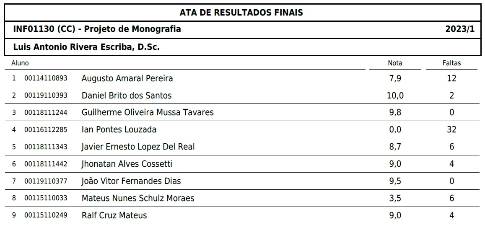

# Classroom - Projeto de Monografia

## 20230707 - Aviso: "Notas em ata"

Luis Antonio Rivera Escriba
Criado em: 7 de jul.7 de jul.
Notas em ata

### Notas tabeladas

| Matrícula   | Nome do Aluno                   | Nota | Faltas |
| ----------- | ------------------------------- | ---: | -----: |
| 00114110893 | Augusto Amaral Pereira          |  7,9 |     12 |
| 00119110393 | Daniel Brito dos Santos         | 10,0 |      2 |
| 00118110393 | Guilherme Olivera Mussa Tavares |  9,8 |      0 |
| 00116111244 | Ian Pontes Louzada              |  0,0 |     32 |
| 00118112285 | Javier Ernesto Lopez Del Real   |  8,7 |      6 |
| 00118111343 | Jhonatan Alves Cosseti          |  9,0 |      4 |
| 00119111442 | João Vítor Fernandes Dias       |  9,5 |      0 |
| 00115110377 | Mateus Nunes Schulz Moraes      |  3,5 |      6 |
| 00115110249 | Ralf Cruz Mateus                |  9,0 |      4 |

## 20230703 - Aviso: "A defesa do "projeto de monografia"…"

Luis Antonio Rivera Escriba
Criado em: 3 de jul.3 de jul.
A defesa do "projeto de monografia" deve ser adiada para o
dia 6 (quinta feira) as 8:00 am, devido ás provas no dia 5 (quarta)
das disciplinas dos professores TANG e ANNABELL.

Rivera

## 20230701 - Aviso: "A defesa do projeto de monografia, como…"

Luis Antonio Rivera Escriba
Criado em: 1 de jul.1 de jul.
A defesa do projeto de monografia, como falado na aula, será dia 4a feira 5 de julho as 9.00am (só temos esse dia disponibilizados pelos professores) - a não apresentacao e reprovacao, porque a banca examinado de projetos da a nota de aprovacao o reprovacao). Devem ter impresso 5 copias de seus trabalhos e entregue para o prof. TANG, ele entregara para cada professor as monografias para as respectivas avaliacoes genericas (a boa apresentacao do tema, problema, hipotese e objetivos), um dominio dos aspetos teoricos e trabalhos relacionados, como a formulacao do modelo de como se deve enfocar a solucao para a implementacao.
Devem preparar slides (power point) de una media de 8 a 10 slides, para apresentacaoa de 15 minutos.
2 a 3 slides da introducao (Cap 1)
3 a 4 slides de teorias e trabalhos relacionados (Cap 2)
2 a 3 slides de modelo (Cap 3)
1 pagina de artigos (fontes) usados.
1 comentário para a turma

João Vitor Fernandes Dias1 de jul.
🙂👍

## 20230629 - Postada por João Vitor Fernandes Dias

João Vitor Fernandes Dias
Criado em: 29 de jun.29 de jun.
Professor, o senhor poderia nos enviar os PDFs das aulas iniciais, por favor?

## 20230529 - Postada por João Vitor Fernandes Dias

João Vitor Fernandes Dias
Criado em: 29 de mai.29 de mai.
Professor, poderia nos enviar o pdf com as Normas de elaboração do TCC que o senhor nos apresentou na aula passada? Tentei encontrar na internet, mas achei um documento diferente e não sei se segue as mesmas regras.

- [Normas para elaboracao de monografia][LinkRegrasMonografia]

## 20230527 - Material: "Tabela-consistencia"

Luis Antonio Rivera Escriba postou um novo material: Tabela-consistencia
Criado em: 27 de mai.27 de mai.

Tabela-consistencia
Luis Antonio Rivera Escriba
•
27 de mai.
Um exemplo da tabela em excell para facilitar a redacção da monografia

- [Matriz Consistência][LinkConsistencia]

## 20230525 - Material: "Monografias de referencia"

Luis Antonio Rivera Escriba postou um novo material: Monografias de referencia
Criado em: 25 de mai.25 de mai. (editado: 27 de mai.)

Monografias de referencia
Luis Antonio Rivera Escriba
•
25 de mai. (editado: 27 de mai.)
Estas monografias podem ser utilizadas como referencia, embora não serem perfeitas. Sugiro que melhorem e evitar arrastando os mesmos erros..

- [Monografia Yago master posDefesa][LinkMonogYago]
- [Monografia Augusto][LinkMonogAugusto]

## 20230525 - Atividade: "5o e 6o artigo técnico - resumo"

Luis Antonio Rivera Escriba postou uma nova atividade: 5o e 6o artigo técnico - resumo
Criado em: 25 de mai.25 de mai.

5o e 6o artigo técnico - resumo
Luis Antonio Rivera Escriba
•
25 de mai.
10 pontos
Data de entrega: 26 de mai., 23:59
Os artigos devem ser e publicação revistas de computação, e de conteúdo
técnico.
Seus trabalhos
Entregue

## 20230509 - Atividade: "4o Artigo - resumido"

Luis Antonio Rivera Escriba postou uma nova atividade: 4o Artigo - resumido
Criado em: 9 de mai.9 de mai.

4o Artigo - resumido
Luis Antonio Rivera Escriba
•
9 de mai.
10 pontos
Data de entrega: 12 de mai., 10:00
Artigo TÉCNICO candidato guia para o desenvolvimento de sua monografia
Seus trabalhos
Entregue com atraso

## 20230502 - Atividade: "3o Artigo - leitura e resumido"

Luis Antonio Rivera Escriba postou uma nova atividade: 3o Artigo - leitura e resumido
Criado em: 2 de mai.2 de mai. (editado: 9 de mai.)

3o Artigo - leitura e resumido
Luis Antonio Rivera Escriba
•
2 de mai. (editado: 9 de mai.)
10 pontos
Data de entrega: 4 de mai., 23:59
Artigo técnico resumido no formato aproximado ao proposto.
Importante que vocês consigam extrair informação útil da fonte.
Informação útil, por exemplo, pode ser envolvendo:
 Apresentação do tema
Problema que aborda no artigo
Objetivos.

Teorias e técnicas utilizadas como base (nesse artigo)
Modelo que o autor propõe como contribuição
Teorias e/ou técnicas criadas

Soluções

<< importante vocês dominem o tema: para demonstrar isso, devem apresentar na sala
de aula >>
Seus trabalhos
Entregue

## 20230421 - Atividade: "2o Artigo: Leitura e resumido"

Luis Antonio Rivera Escriba postou uma nova atividade: 2o Artigo: Leitura e resumido
Criado em: 21 de abr.21 de abr.

2o Artigo: Leitura e resumido
Luis Antonio Rivera Escriba
•
21 de abr.
10 pontos
Data de entrega: 28 de abr., 09:59
Similar ao anterior...
Anexo modelo aproximado para seguir..

### 20230421 - 1 comentário para a turma

Javier Ernesto Lopez Del Real5 de mai.
A Comparative Analysis of Techniques for Predicting Student Performance

## 20230421 - Postada por Daniel Brito dos Santos

Daniel Brito dos Santos
Criado em: 21 de abr.21 de abr.
Boa noite professor!
Nós, alunos de Projeto de Monografia, ponderamos que por se tratar de um feriado nacional muitos dos colegas não poderão comparecer no encontro proposto para sexta-feira (21/04/23). Em respeito a este fato e aos compromissos familiares que muitos de nós temos, entramos no consenso de solicitar que a apresentação seja realizada em um outro dia.

Agradeço a compreensão, um ótimo feriado e final de semana pro senhor.

## 20230417 - Atividade: "1o Artigo-leitura e resumido."

Luis Antonio Rivera Escriba postou uma nova atividade: 1o Artigo-leitura e resumido.
Criado em: 17 de abr.17 de abr. (editado: 21 de abr.)

1o Artigo-leitura e resumido.
Luis Antonio Rivera Escriba
•
17 de abr. (editado: 21 de abr.)
10 pontos
Data de entrega: 21 de abr., 09:59
Colocar aqui seus resumos do artigo
Resumo desconsiderar:
Titulo do artigo, Autores, Revista

1. motivação, problema e objetivos do autor que escreveu o artigo
2. Estado de arte e teorias usadas
3. a contribuição acadêmica do artigo (a parte principal do trabalho)
4. Qual vai ser utilidade deste artigo na sua pesquisa.

Seus trabalhos
Entregue com atraso

## 20230417 - Aviso: "As leituras de artigos se realizam seja…"

Luis Antonio Rivera Escriba
Criado em: 17 de abr.17 de abr.
As leituras de artigos se realizam seja feriado ou não.
Tempo não alcança.
Nessa sexta vou ficar na aula de classroom.
para as apresentações... devem colocar seus resumos
nas atividades

### 20230417 - 2 comentários para a turma

Guilherme Oliveira Mussa Tavares17 de abr.
Professor, não entendi se a apresentação será online ou presencial.

Luis Antonio Rivera Escriba18 de abr.
So nesta semana que a sexta é feriado será online. Na seguinte semana, com leitura de outro artigo, a apresentacao será presencial

## Links (Abra o markdown raw para poder ver)

[LinkRegrasMonografia]: https://github.com/UENF-Conteudo-de-Disciplinas/INF01130-Projeto_de_Monografia/blob/main/Files/Classroom/Normas-para-elaboracao-de-monografia-1.docx
[LinkConsistencia]: https://github.com/UENF-Conteudo-de-Disciplinas/INF01130-Projeto_de_Monografia/blob/main/Files/Classroom/LRE-tabelaResumo-consistencia.xlsx
[LinkMonogAugusto]: https://github.com/UENF-Conteudo-de-Disciplinas/INF01130-Projeto_de_Monografia/blob/main/Files/Classroom/monografia_master_posDefesa.pdf
[LinkMonogYago]: https://github.com/UENF-Conteudo-de-Disciplinas/INF01130-Projeto_de_Monografia/blob/main/Files/Classroom/monografia-augusto.pdf
