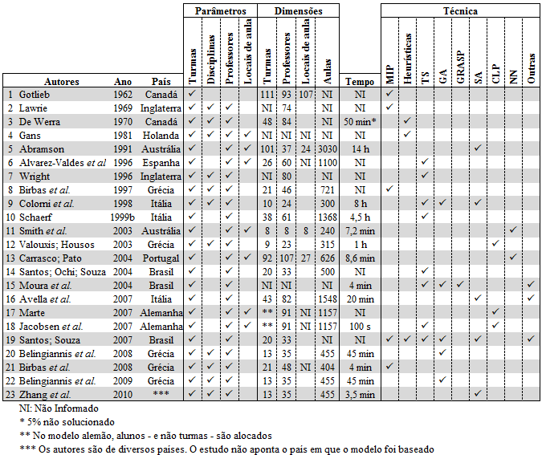
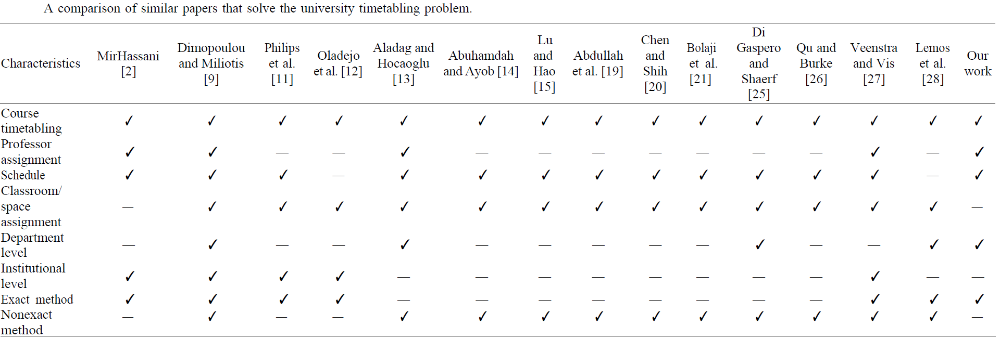

# TCC

## Capa e folha de rosto

João Vítor Fernandes Dias
*Timetabling Problem*: desafios no desenvolvimento de um sistema de decisão voltado ao problema de organização de grade horária para universidades

## Sumário

1. Introdução
   1. Problemática
   2. Hipótese
   3. Objetivos
      1. Gerais
      2. Específicos
   4. Justificativas
   5. Metodologia
      1. Modelagem conceitual
      2. Pesquisa de campo
   6. Estrutura/Organização
2. Revisão da Literatura/Referencial Teórico
   1. Contexto histórico
   2. Origem
   3. Técnicas existentes(?)
   4. Antigos
      1. Qual é o problema?
      2. Há solução?
      3. Quais são os desafios da solução do problema?
      4. Como resolver os desafios?
3. Capítulos soltos meus
4. Desenvolvimento
   1. Desenvolvimento prévio (Demanda)
   2. Seleção das ferramentas
5. Resultados (e Discussões(?))
   1. Avaliação dos resultados
6. Conclusão e trabalhos futuros
7. Anexo: questionário realizado
8. Referências

## 1. Introdução

- A realidade do ensino superior brasileiro
  - Muitas reprovações
  - Grade horária confusa
  - Professores limitados
  - Preferências diversas     X
    - Professores             X
      - Horários              X
    - Alunos
      - Estágio               X
      - Trabalho
      - Formar rápido
  - Demanda variada
  - Caso específico da UENF   X

No ensino superior brasileiro, cada curso de uma instituição de ensino tem em seu projeto pedagógico, ou seja, no documento que rege quais as atribuições e justificativas de existência do curso, uma listagem de disciplinas a serem ministradas em cada semestre ao longo de sua duração esperada. Disciplinas estas que para serem cursadas os discentes precisam cumprir determinados requisitos. Por exemplo, é esperado que o discente apenas curse a disciplina Cálculo 2 após haver obtido a aprovação prévia na disciplina Cálculo 1.

<!--
- Pesquisar quais são as regras que todos os cursos superiores devem seguir para serem reconhecidos pelo MEC
- Qual a definição de projeto pedagógico?
- Todos os PPCs dos cursos apresentam a listagem das disciplinas?
-->

Embora haja este planejamento de duração do curso, diversos fatores podem influenciar esta previsão, dentre eles podemos citar eventos como:

- Quebra de pré-requisitos: onde o discente solicita permissão para inscrição em uma disciplina cujos pré-requisitos não são completamente cumpridas por si
- Trancamento de matrícula: onde o discente suspende temporariamente seus estudos na instituição
- Transferência interna: onde o discente migra entre cursos dentro da mesma instituição
- Transferência externa: onde o discente migra entre cursos entre diferentes instituições
- Reprovações: onde o discente não cumpre com o mínimo desempenho esperado na disciplina, geralmente está associado a ausência nas aulas e/ou desempenho inferior ao mínimo esperado nas avaliações.
- Disponibilidade de professores: onde os docentes não são suficientes para ministrar todas as disciplinas demandadas pelos discentes em um mesmo semestre.

<!--
- Pesquisar se algum órgão público tem dados de reprovações e esses outros eventos.
- Analisar melhor a questão da disponibilidade dos professores.
-->

Estes eventos tendem a, no geral, aumentar o tempo médio para conclusão do curso. Situação em sua maioria indesejada tanto pelos alunos, que mesmo durante seu estudo já visam o mercado de trabalho, quanto pelos professores e a instituição, visto que a evasão do ensino superior brasileiro é um problema existente e estudado a fim de ser minimizado.

<!--
- Pesquisar sobre motivos de evasão do ensino superior
- Adicionar citação
-->

Com isso, é esperado que a instituição busque alternativas para tornar mais dinâmica e atrativa a experiência dos discentes durante sua jornada. Uma dessas formas é tentando minimizar o impacto que as reprovações nas disciplinas causam nos semestres consecutivos. Para isso sendo então necessária uma análise das disciplinas que devem ser ministradas no próximo semestre, sendo então necessário definir **quais**, **quando**, **onde**, **por quem** e **para quem** serão ministradas. Esta tarefa, entretanto, não é trivial.

### 1.1. Problemáticas

Embora seja um problema atualmente, isso não significa que seja recente. Desde 1978 \cite{BARHAM1978} o termo \textit{timetabling} encontra-se no meio acadêmico como o termo referente ao tabelamento de grade horária, sendo assim, é este o termo que será principalmente utilizado neste trabalho. Neste artigo de 1978 já se propunha uma forma para que se obtivesse um tabelamento otimizado, e demonstrava que o método utilizado gerava bons resultados.

Outra característica é informada por Joshua \cite{THOMAS2009} que fala sobre a multidimensional do problema de timetabling. Por causa dessa questão há uma complexidade elevada para conseguir conceber visual e mentalmente de que forma os dados relacionados ao problema se estruturam, assim dificultando a elaboração de sistemas computacionais que auxiliem nessa tarefa.

Dada a grande quantidade de variáveis interconectadas e as características específicas de cada instituição \cite{MIRANDA2012505}, a organização destas informações buscando a melhor solução possível apresenta-se como um desafio. Principalmente se considerarmos que esta solução é, muitas vezes, buscada manualmente, estando também passível de erros humanos como ilustram as Figuras [1](Figura-1) e [2](Figura-2).

Nestas imagens, fica exemplificado um dos possíveis problemas que podem ocorrer durante a criação de grades horárias, que é, mesmo quando uma seção da universidade (o Sistema Acadêmico, ilustrado pela [Figura 1](Figura-1)) aloca uma turma a uma determinada sala, outra seção da mesma instituição (o Centro de Ciência e Tecnologia, ilustrado pela [Figura 2](Figura-2)) pode não estar ciente do mesmo, ou mesmo estando ciente pode acabar não delimitando aquela lacuna de tempo como ocupada, assim estando passível de uma segunda alocação naquele período de tempo naquela sala, assim gerando problemas.

Também segundo J. Miranda, embora o problema de atribuição de salas não seja novo e tenha extensa literatura a seu respeito, são poucos os que de fato implementaram um sistema para suporte de decisões. Isso se dá por diversos fatores, também listado pelo autor fazendo referência a trabalhos anteriores, sendo alguns deles a resistência organizacional à mudanças e adoção de novas tecnologias, nível de dificuldade do problema, dentre outros.

<!-- %  Pegar a referência original? -->

Algumas outras características que se apresentam como problemas são a falta de otimalidade das grades horárias desenvolvidas em boa parte das instituições de ensino superior e a quantidade de tempo necessária para a criação dessas grades não-ótimas.

Considerando que situações como a descrita acima são passíveis de ocorrer, e que a tarefa de criação de grades horárias é recorrente, um sistema de suporte à decisão que supra às necessidades dos seus usuários se faz necessário.

#### Figuras

##### Figura 1

##### Figura 2

### 1.2. Hipótese

Dada as características intrínsecas ao problema de agendamento de grade horária, é esperado que os softwares atualmente existentes que lidam com este problema não apresentem completas capacidades de se moldar ao caso de uma instituição específica.

E, caso a primeira hipótese se apresente correta, o software a ser desenvolvido, assim como seus similares, se apresentará como uma solução plausível para a resolução do problema proposto embora ainda apresente melhorias possíveis a serem implementadas. O software se apresentará de tal forma que os *stakeholders* que, esperadamente, decidirem não o utilizar não causarão a impossibilidade do uso do sistema.

<!--
- Os softwares existentes não são adequados para o caso específico
- Embora seja possível implementar
  - Será trabalhoso
  - Precisará atender muitos requisitos
  - Nem todos stakeholders aceitarão facilmente a mudança
  - O sistema não será tão intuitivo quanto poderia ser
  - Muitos não veem essa questão como um problema
  - Alguns não acham necessário haver mudança no método de elaboração das grades
-->

### 1.3. Objetivos

Os objetivos deste documento podem ser divididos entre gerais e específicos, não havendo relação de superioridade de um em relação ao outro, visto que ambos igualmente nortearão o desenvolvimento da pesquisa.

#### 3.1. Gerais

<!--
- Sistema de suporte à decisão
  - Eficiente
  - Eficaz
  - Efetivo
- Criar grades horárias melhores, preferencialmente ótimas
- Reduzir tempo necessário para criação das tabelas
- Reduzir conflitos
- Aumentar satisfação geral com as disciplinas e horários ofertados
-->

Como objetivos gerais, espera-se conseguir desenvolver um sistema de suporte à decisão tal que aumente a eficiência, eficácia e efetividade do processo de criação de grades horárias que semestralmente demandam extensa quantidade de tempo dos coordenadores de curso na UENF e não alcançam a otimalidade. Nesse processo, também é esperado que as grades horárias finais tragam benefícios aos alunos como forma de mais disciplinas à sua disposição. Visto que estes muitas vezes lidam com grades horárias que não contemplam suas reais demandas. Dessa forma aumentando a satisfação de todos os participantes do processo, desde os coordenadores de curso até os alunos.

#### 3.2. Específicos

Como objetivos mais específicos, podemos listar os seguintes:

- Entender de que forma os setores administrativos da UENF atualmente lidam com a questão do \textit{timetabling}
- Obter as demandas de aprimoramentos desejadas pelos diferentes centros e laboratórios
- Modelar o sistema de resolução de \textit{timetabling} de acordo com os requisitos demandados
- Encontrar o que é necessário para a adoção da aplicação de tabelamento de horário
- Incentivar o uso de uma ferramenta centralizada para a otimização do \textit{Timetabling Problem}

### 1.4. Justificativas

Levando em conta a problemática evidenciada e os sucessos prévios dos artigos anteriores, vê-se grande potencial de auxílio e aumento na satisfação de todos os que utilizarem os métodos propostos. Não havendo um sistema geral que solucione todos os casos como evidenciado pelos pesquisadores da área, resta aos interessados rumarem em busca de uma solução entalhada nos moldes de sua instituição específica. Considerando que é um problema existente atualmente e que uma solução está disponível, o que se torna necessário é realizar o esforço inicial suficiente para que ocorra a quebra da inércia em que se encontram os processos ineficientes usuais para assim alcançar um melhor. Sendo assim, faz-se válida a pesquisa e desenvolvimento de um software que vise este propósito.

<!--
- Levando em conta a problemática e o os sucessos prévios de artigos anteriores
- As instituições públicas idealmente deveriam ter um sistema próprio para a resolução de seus próprios conflitos
- Não havendo o interesse ou conhecimento geral para este fim, resta aos alunos e pesquisadores interessados buscarem uma solução entalhada nos moldes de sua instituição
- Considerando que é um problema existente na instituição e que é resolvível, sendo necessário o esforço inicial de quebrar a inércia dos processos usuais para se alcançar um melhor, faz-se válida a pesquisa e desenvolvimento de um software que vise este propósito.
-->

### 1.5. Metodologia

<!--
- Entrevistas qualitativas com stakeholders     x
  - Adicionar perguntas aqui                    .
- Formulário quantitativo com alunos            x
  - Adicionar perguntas aqui                    .
- Elicitação de requisitos                      x
  - Falar sobre o SWEBOK                        x
- Desenvolvimento do software                   .
  - CI/CD                                       .
    - Testes                                    .
    - GitHub                                    .
  - Programação modular                         SWEBOK
  - Obtenção de demanda                         .
    - Extratos                                  .
      - Processamento e limpeza                 .
      - Estruturando dados                      .
    - Acadêmico                                 .
    - Formulário                                .
  - Criando solução inicial                     .
  - Otimizando                                  .
    - Algoritmos                                .
    - Interatividade                            .
      - Visualização                            .
-->

Considerando as dificuldades encontradas em trabalhos anteriores, entende-se que o maior desafio será superar as especificidades que serão encontradas durante a modelagem da universidade em questão. Para isso, será inicialmente necessária uma pesquisa bibliográfica com foco no estudo das abordagens qualitativas realizadas anteriormente que obtiveram sucesso em elicitar os requisitos adequados para as instituições de ensino.

<!-- % Adicionar referência sobre pesquisa qualitativa? -->

Com este conhecimento, um material inicial para a pesquisa exploratória e qualitativa deve ser desenvolvido levando em conta as questões próprias da universidade em questão, visando também coletar dados relevantes para uma futura pesquisa com maior enfoque em características emergentes que a pesquisa anterior pode levantar, similar a como foi proposto e realizado por \cite{DinataAndre2018}.

<!--
@book{SWEBOK2014,
  abstract = {The purpose of the Guide to the Software Engineering Body of Knowledge is to provide a validated classification of the bounds of the software engineering discipline and topical access that will support this discipline. The Body of Knowledge is subdivided into a set of software engineering Knowledge Areas (KA) that differentiate among the various important concepts, allowing readers to find their way quickly to subjects of interest. Upon finding a subject, readers are referred to key papers or book chapters. SWEBOK Guide V3.0 builds upon SWEBOK 2004 to refresh and add new reviewed content. Emphases on engineering practice lead the Guide toward a strong relationship with the normative literature. The normative literature is validated by consensus formed among practitioners and is concentrated in standards and related documents. The two major standards bodies for software engineering (IEEE Computer Society Software and Systems Engineering Standards Committee and ISO/IEC JTC1/SC7) are represented in the project. The Guide is oriented toward a variety of audiences, all over the world. It aims to serve public and private organizations in need of a consistent view of software engineering for defining education and training requirements, classifying jobs, developing performance evaluation policies or specifying software development tasks. It also addresses practicing, or managing, software engineers and the officials responsible for making public policy regarding licensing and professional guidelines. In addition, professional societies and educators defining the certification rules, accreditation policies for university curricula, and guidelines for professional practice will benefit from the SWEBOK Guide, as well as the students learning the software engineering profession and educators and trainers engaged in defining curricula and course content. It is hoped that readers will find this book useful in guiding them toward the knowledge and resources they need in their lifelong career development as software engineering professionals.},
  added-at = {2015-11-14T19:42:45.000+0100},
  address = {Los Alamitos, CA},
  biburl = {https://www.bibsonomy.org/bibtex/20a639ccf1021eb07ebe986475b2b4ea7/flint63},
  edition = {Version 3.0},
  editor = {Bourque, Pierre and Fairley, Richard E.},
  file = {IEEE Digital Library:2014/SWEBOK2014.pdf:PDF},
  groups = {public},
  interhash = {71f2a73744854489fa230b28723bbf1f},
  intrahash = {0a639ccf1021eb07ebe986475b2b4ea7},
  isbn = {978-0-7695-5166-1},
  keywords = {01841 103 ieee book software engineering guide},
  publisher = {IEEE Computer Society},
  timestamp = {2018-04-16T12:18:50.000+0200},
  title = {{SWEBOK}: Guide to the Software Engineering Body of Knowledge},
  url = {http://www.swebok.org/},
  username = {flint63},
  year = 2014
}
-->

Nesta pesquisa exploratória em formato de entrevista, algumas informações esperadas revolvem em torno das percepções dos \textit{stakeholders} do sistema proposto, sendo esses principalmente os professores, coordenadores de cursos, chefes de laboratório e diretores de centro. Estas percepções incluem o entendimento deles quanto ao método atual e às alternativas existentes, nível de insatisfação com o método atual, nível de desejo quanto à um novo método. Além disso, espera-se aproveitar o ensejo para elicitar as características e funcionalidades que gostariam de ter em um sistema de suporte à decisão, solicitando também que deem informações adicionais que gostariam de acrescentar.

Essas informações serão relevantes para se atingir a satisfação e uso futuro do sistema proposto. Pois, como é informado no \cite{SWEBOK2014}, uma das fontes de requisitos é o ambiente organizacional e como o software muitas vezes visa auxiliar em algum processo da instituição, processo este já condicionado à sua estrutura, cultura e políticas externas, o engenheiro de software precisa estar atento a elas, visto que o novo software não deve forçar mudanças não planejadas em processos de negócios.

Questionamentos similares também serão realizados com alunos, porém em formato de formulário online para facilitar o processamento dos dados coletados.

[LinkParadigm]: https://www.visual-paradigm.com/
[LinkDrawio]: drawio.com
[LinkMermaid]: https://mermaid.js.org/

Tendo obtido as informações dos \textit{stakeholders} primários, será então necessário modelar quais são as regras que ditam a estrutura organizacional em foco. Para este fim, serão utilizados diagramas conceituais utilizando softwares de suporte como o [Visual Paradigm][LinkParadigm], [Draw.io][LinkDrawio] e a [ferramenta Mermaid][LinkMermaid].

<!-- Essa parte de baixo tá muito estranha. Revisar depois -->

Esta etapa será de grande importância pois guiará a pesquisa para quais serão os detalhes dos módulos existentes durante o desenvolvimento do projeto, bem como esclarecerá visualmente quais são as informações sobre os recursos que são necessárias para se calcular a grade ótima. Como por exemplo:

1. Salas
   1. Quais são as salas disponíveis?
   2. Quais as capacidades de cada um?
   3. Em quais horários estão disponíveis?
   4. Quais são suas peculiaridades?
      1. Têm computadores?
      2. Têm quadro?
      3. Têm televisão?
      4. Têm projetor?
2. Alunos
   1. Quantos são?
   2. Quais matérias demandam?
3. Professores
   1. Quais disciplinas ministram?
   2. Quantas disciplinas podem ministrar?
   3. Quais seus horários de preferência?

Com as regras organizacionais e variáveis bem definidas, serão testados alguns softwares que visam a criação de grades horárias para confirmar se há a real necessidade de se desenvolver um software específico para a instituição. Após realizados os testes, caso os softwares existentes supram as necessidades, este será utilizado nos passos seguintes. De outro modo, haverá a necessidade de desenvolvimento de um sistema de suporte à decisão como ferramenta centralizada para este fim.

Independente de qual dos softwares será testada a aplicabilidade do mesmo no contexto universitário e será mensurada a satisfação dos *stakeholders* durante o seu uso, assim buscando assegurar o seu uso na criação de grades horárias ótimas futuras.

### 1.6. Estrutura/Organização

Este trabalho abordará capítulos que de forma resumida lidam com os seguintes tópicos:

- O capítulo 1 de introdução traça informações gerais sobre o assunto do trabalho, elaborando mais detalhadamente quanto à sua problemática, hipótese, objetivos, justificativas, a metodologia escolhida e a organização de suas informações.
- O capítulo 2 de revisão literária informa mais detalhadamente sobre os problemas de agendamento, suas categorias, soluções, desafios e definições de termos.
- O capítulo 3 de desenvolvimento apresenta as informações coletadas durante as entrevistas. Apresenta também a estrutura geral dos códigos feitos, principalmente ilustrando quais os comportamentos esperados em cada um dos módulos, bem como quais foram as ferramentas utilizadas e as práticas seguidas.
- O Capítulo 4 de resultados e discussões demonstra o software final utilizado, apresenta comparações da qualidades entre grades horárias geradas pelo software e as que foram utilizadas nos últimos semestres. Apresenta também a pesquisa de satisfação realizada com os *stakeholders* entrevistados no início do desenvolvimento.
- O Capítulo 5 da conclusão e trabalhos futuros finaliza o presente trabalho com os pensamentos gerais sobre a pesquisa e desenvolvimento, apresentando as características não abordadas e indicando caminhos a serem seguidos por pesquisadores posteriormente.

## 2. Contexto do *Timetabling Problem* no meio acadêmico

Antes de prosseguirmos com o desenrolar deste trabalho, é adequado que primeiro definamos alguns parâmetros para o melhor entendimento do que está por vir.

### 2.1 Definição de termos

Ao longo dos anos de desenvolvimento acadêmico, diversos assuntos vão se aprofundando e se tornando mais específicos, assim, os estudiosos acabam cunhando novos termos que o auxiliam a desvencilhar as novas áreas específicas das suas áreas originárias. Porém, existe o potencial de que haja um crescimento desestruturado destes novos termos, assim vários termos diferentes podem se referir a um mesmo conceito, enquanto que um mesmo tempo pode se referir a vários conceitos diferentes de acordo com o autor.

Assim como feito por \cite{WREN1996}, definiremos os conceitos dos termos que serão usados ao longo deste trabalho.

O termo "*timetable*" tem o mesmo valor que "grade horária" e serão usadas como se fossem sinônimos mesmo sendo de línguas diferentes. Segundo \cite{WREN1996}, podemos definir *timetable* como uma estrutura que mostra quando que eventos ocorrerão, não havendo necessáriamente a alocação de recursos.

Vale ressaltar que este termo não tem seu uso limitado para os fins desta pesquisa, sendo também usado para problemas de alocação de enfermeiros, esportes, funcionários e transportes \cite{University Course Timetabling Problem with Professor Assignment}. Entretanto, neste trabalho, abordaremos principalmente os termos relacionados ao que pode ser chamado de *Euducational Timetabling* (Ed-TT) \cite{Visualization Methods for Educational Timetabling Problems: A Systematic Review of Literature}, que é o que tende a envolver um conjunto específico de recursos relacionados à educação.

Wren também define os conceitos para *class timetable*, *university examination timetable* e *university class timetable*, tendo relevância apenas o último, que considera a disponibilidade de professores e salas, a quantidade de alunos e os requisitos que determinada disciplina exige.

Exemplo: Enquanto que a disciplina "Laboratório de Física" exige que a aula seja ministrada em uma tipo de sala específica com os equipamentos necessários, a disciplina "computação e sociedade" não apresenta esta restrição, ficando limitada apenas à quantidade de pessoas na turma.

Aqui, visto que uma solução final envolverá várias dimensões (Professores x Disciplinas x Sala x Alunos x Horários x Dias), consideraremos *timetable* como esse pacote de valores distribuídos em uma só estrutura. Para que esses valores sejam distribuídos, daremos o nome de **alocação** ao ato de criar qualquer relação entre as dimensões. Como a relação de horários e dias será considerada fixa, a **alocação** se referirá à atribuição como a de professores à disciplinas, disciplinas à salas, disciplinas à um determinado padrão de dias e horários, etc.

Para que esta alocação ocorra, é necessário atender a certos critérios, e aí entra o "problema de organização de grade horária", também chamado de *timetabling problem*. Esta é uma subcategoria do \textbf{problema de agendamento} (\textit{scheduling Optimization Problem}) \cite{Visualization Methods for Educational Timetabling Problems: A Systematic Review of Literature} que por sua vez é definido por \cite{WREN1996} como sendo:

> Resolver problemas práticos relacionados à alocação, sujeito a restrições, de recursos a objetos sendo colocados no espaço-tempo, usando ou desenvolvendo quaisquer ferramentas que possam ser apropriadas. Os problemas irão frequentemente se relacionar à satisfação de certos objetivos.

Outro termo relevante a se pontuar são as *hard and soft constraints* que podemos chamar de restrições rígidas e flexíveis. \cite{Visualization Methods} as define dizendo que as restrições rígidas são de atendimento obrigatório, enquanto as restrições flexíveis são opcionais, mas convenientes para melhorar a qualidade da solução obtida.

Exemplo de restrição rígida: nem professores nem alunos podem ser alocados simultaneamente a duas salas ou disciplinas simultaneamente. Uma solução que viole esta restrição se torna automaticamente inviável.

Exemplo de restrição flexível: professor J. prefere não dar aulas nas tardes de sexta-feira, e prefere dar aula nas manhãs da segunda-feira. Uma solução que viole esta restrição não se torna inviável, porém tende a ter menos valor neste critério do que uma solução que siga as preferências definidas.

Alguns outros termos termos similares à este campo de pesquisa encontrados na literatura são *periodic event scheduling problem*, *timetable scheduling*, *class scheduling*, *student scheduling*, *university course timetabling*, dentre outros.

### 2.2. Métodos de resolução

<!--
- O problema de timetabling   a
  - Origem                    a
  - Repartições               a
  - Escopo maior              a
    - Scheduling              a
  - Escopo menor              a
    - Exam                    a
    - Class                   a
- TT
  - Soluções
  - Desafios
  - Diversas formas de resolução
    - Graph Coloring
    - Heurísticas
    - Meta-heurísticas
    - IA
    - etc.
- Visualização de informações
  - Benefícios
  - Motivações
  - Relação com timetabling
- Problema geral a ser resolvido
  - Multi dimensionalidade
    - Professores
    - Alunos
    - Salas
    - Departamentos
      - Preferências
      - Concorrências
  - Otimalidade
  - Erros humanos
  - Número de possibilidades
  - Interface intuitiva e relevante é um desafio com poucos estudos nos últimos anos
- Problemas específicos
  - Regras específicas
  - Prioridades diferentes
  - estrutura organizacional semi-exclusiva
-->

<!-- Pesquisar posteriormente sobre imagens que ilustrem bem as diferentes sub categorias de scheduling -->

Existem diversas implementações já realizadas, utilizando uma miríade de métodos. Em seu trabalho, J. Miranda \cite{MIRANDA2012505} informa sobre diversos sistemas baseados em computador para auxiliar na tarefa de agendamento. J. Miranda também cita um dos métodos de resolução como sendo o \textbf{modelo de programação inteira} e \textbf{heurísticas}.

Outros trabalhos buscaram condensar em forma de tabela as informações encontradas. Abaixo estão dispostas algumas das tabelas encontradas durante o estudo bibliográfico e que foram elaboradas por diversos autores.

Na figura \ref{desenvolvimento}, \cite{Desenvolvimento de um Modelo para o School Timetabling Problem Baseado na Meta-Heurística Simulated Annealing} traça a relação entre os diversos autores, ano de sua publicação e seu país de origem com os dados encontrados em sesu trabalhos quanto aos parâmetros utilizados na elaboração da grade horária, quão grandes eram cada um de seus parâmetros, quanto tempo foi necessário para achar uma solução e quais foram as técnicas utilizadas.

Na figura \ref{University}, \cite{University Course Timetabling Problem with Professor Assignment}, apresenta uma comparação similar à anterior, porém não separada em categorias, apenas categorizando entre verdadeiro e falso algumas características como alocação de salas, professores, nível institucional e método exato ou inexato.

Na figura \ref{Visualization}, \cite{Visualization Methods for Educational Timetabling Problems: A Systematic Review of Literature} explora uma categoria mais específica do problema, que é a característica da interatividade das interfaces desenvolvidas. Este apresenta características qualitativas quanto aos métodos, os dados dispostos, as técnicas de interação e o método utilizado para solucionar o problema de grade horária educacional.

### 2.3. Desafios recorrentes

Apesar da vasta quantidade de trabalhos realizados com este fim, o *Timetabling Problem* segue sendo uma área sem uma solução definitiva.

Tomáš Müller \cite{MURRAY2007} traz a questão da modelagem como um dos maiores obstáculos. À medida em que a complexidade aumenta, se torna cada vez mais difícil desenvolver uma solução efetiva. Assim fazendo com que a solução para uma universidade possa não ter utilidade para outras, ou até mesmo não seja capaz de lidar com todos os problemas de uma mesma universidade.

Apesar do contra-fluxo encontrado na resolução dessa problema, Tomáš cita que, apesar da complexidade, é sim possível desenvolver soluções que tenham uso prático, mesmo que não seja um processo fácil. As ferramentas existem e estão disponíveis. Restando então considerar e resolver as preocupações dos usuários às questões, visto que as técnicas de resolução já se encontram vastamente documentados.

Com isso, entramos também no ramo da Interação Homem-Máquina, ramo abordado por Dinata \cite{ANDRE2018} que visou em seu desenvolvimento a criação de uma interface focada no usuário. Assim minimizando o atrito na abordagem desse problema complexo. Também sendo área de enfoque de \cite{Visualization Methods for Educational Timetabling Problems: A Systematic Review of Literature} em sua revisão literária

<!--
### 2.5. Contexto histórico e origem

- Como surgiu essa área? Em que momento ela se dividiu? Devo falar sobre isso?

### 2.6. Técnicas existentes(?)

- Falar sobre técnicas existentes e quem já fez. Tipo o que aquele artigo sem DOI fez
-->

## 3. Desenvolvimento

- Diagramas
  - Visual Paradigm
  - Drawio
  - Mermaid
- Explicar quais são as boas práticas e o que se tem usado
  - Falar mais uma vez sobre o SWEBOK
  - CI/CD
  - Testes
  - GitHub
  - Programação Modular
    - Módulos:
      - Obtenção
        - Programação modular
        - Obtenção de demanda
          - Extratos
            - Processamento e limpeza
            - Estruturando dados
          - Acadêmico
          - Formulário
        - Criando solução inicial
        - Otimizando
          - Algoritmos
          - Interatividade
            - Visualização

## 4. Resultados (e Discussões(?))

- Informar o que foi construído e qual foi a estrutura usada, bem como o site em que o programa estará rodando
- Tabela de comparação de valores de qualidade de todas as relações entre demandas e grades. Incluindo as soluções encontradas pelo algoritmo
- Pesquisa de satisfação

## 5. Conclusão e trabalhos futuros

- Aqui serão tratados alguns pensamentos gerais quanto ao trabalho realizado e seus possíveis desdobramentos futuros.

### 6.1. Conclusões

- Foi difícil
- Mas gerou os resultados esperados
- Maior dificuldade foi a interface

### 6.2. Trabalhos futuros

- Espera-se que novas heurísticas sejam implementadas
- Criar uma página de estatísticas informando...
  - A quantidade de variáveis utilizadas
  - Qual das heurísticas teve melhor de solução
  - Qual foi mais rápida
- Manipulação das restrições
  - Adicionar e remover restrições
  - Mudar pesos das restrições

## 6. Anexo A: questionário realizado

- Listar as perguntas realizadas

## 8. Referências

- Importar referências
- Usar Zotero?
